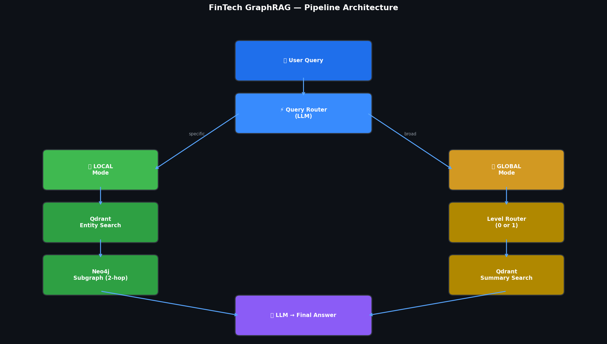

# 🏦 FinTech Adaptive Hierarchical GraphRAG

> **Built from scratch by Huzaifa Qureshi**  
> A production-grade GraphRAG pipeline for FinTech — no black-box frameworks, full control.

---

## 1. Project Overview — The "Why"

### What is this?

This is **not** a standard RAG system.

This is an **Adaptive Hierarchical GraphRAG** — a custom-built pipeline that combines the power of **Graph Topology** (Neo4j) with **Hierarchical Vector Search** (Qdrant) to answer both specific and broad financial queries with surgical precision.

### The Problem with Standard RAG

```
Standard RAG:
User: "How does Visa's dominance affect the entire payments ecosystem?"

RAG: *retrieves 5 random chunks*
     *fills context window with noise*
     *hallucinates connections that don't exist*
     Answer: ❌ Fragmented. Incomplete. Unreliable.
```

Standard RAG has **three fundamental failures** in FinTech:

| Problem | Impact |
|---|---|
| Flat data representation | Cannot understand entity relationships |
| No contextual awareness | Misses cross-company dependencies |
| Context window flooding | Expensive + inaccurate on global queries |

### Our Solution

```
This System:
User: "How does Visa's dominance affect the entire payments ecosystem?"

Step 1: Router detects → GLOBAL query
Step 2: Qdrant fetches → Level 1 strategic summaries (filtered)
Step 3: LLM synthesizes → Ecosystem-level answer

Answer: ✅ Accurate. Contextual. Grounded in graph data.
```

We solve this with **three innovations**:
1. **Graph Topology** — Real relationships stored in Neo4j, not just text chunks
2. **Hierarchical Summaries** — Level 0 (sector) + Level 1 (industry-wide) stored separately
3. **Intelligent Routing** — LLM decides LOCAL vs GLOBAL before any retrieval happens

---

## 2. Tech Stack

| Component | Technology | Why |
|---|---|---|
| **Graph Database** | Neo4j AuraDB | Real relationship storage, multi-hop Cypher traversal |
| **Vector Database** | Qdrant Cloud | Payload filtering for hierarchical level search |
| **LLM** | LLaMA 3.3-70B via Groq | High-speed inference, structured JSON extraction |
| **Structured Output** | Instructor + Pydantic | Guaranteed schema-valid LLM responses |
| **Embeddings** | `all-MiniLM-L6-v2` | Fast, lightweight, 384-dim semantic embeddings |
| **Community Detection** | Neo4j GDS — Leiden | Hierarchical community clustering |
| **Orchestration** | Custom Python | Full control, no black-box frameworks |

---

## 3. Core Architecture



```
                        USER QUERY
                            │
                    ┌───────▼────────┐
                    │  Query Router  │  ← LLM classifies: LOCAL or GLOBAL
                    └───────┬────────┘
                            │
              ┌─────────────┴──────────────┐
              │                            │
         LOCAL query                  GLOBAL query
    (specific entities)           (trends, industry)
              │                            │
         ┌────▼────┐                  ┌────▼────┐
         │ Qdrant  │                  │ Level   │
         │ Entity  │                  │ Router  │
         │ Search  │                  │ (0 or 1)│
         └────┬────┘                  └────┬────┘
              │                            │
         ┌────▼────┐                  ┌────▼────────┐
         │ Neo4j   │                  │ Qdrant      │
         │ Subgraph│                  │ Summary     │
         │ 1..2    │                  │ Search      │
         │ hops    │                  │ (filtered)  │
         └────┬────┘                  └────┬────────┘
              │                            │
              └──────────┬─────────────────┘
                         │
                  ┌──────▼──────┐
                  │     LLM     │
                  │ Final Answer│
                  └─────────────┘
```

### Step-by-Step Pipeline

**Step 1 — Real Company Data via LLM**
The LLM is prompted to return real, well-known FinTech companies (Visa, Mastercard, PayPal, Stripe, etc.) and generate their profiles grounded in actual market knowledge — real CEOs, realistic financials, and actual industry relationships.

**Step 2 — Community Detection (Leiden Algorithm)**
Neo4j GDS runs the Leiden algorithm with `includeIntermediateCommunities: true` to build a hierarchy:
- **Level 0** — Fine-grained sector clusters (e.g., "Digital Payments Group")
- **Level 1** — Strategic industry groups (e.g., "FinTech Ecosystem")

**Step 3 — Multi-Level Summarization**
Each community gets an LLM-generated summary stored in Qdrant with level metadata:
```python
payload = {"text": summary, "level": 0}  # Fine-grained
payload = {"text": summary, "level": 1}  # Strategic
```

**Step 4 — The Master Router**
Every query goes through an LLM router first:
```
LOCAL  → Qdrant entity search → Neo4j subgraph → Answer
GLOBAL → Level-filtered Qdrant summary search → Answer
```

---

## 4. Key Design Decisions & Fixes

### Fix 1: Real Companies — Not Fictional Data

**Problem:** Original prompts asked the LLM to generate fictional FinTech company names. This meant all relationship data, CEO names, and financials were hallucinated with no grounding.

**Solution:** Prompts now explicitly request **real, well-known FinTech companies** from the global market:
```python
# WRONG — fictional, ungrounded data
"Generate N unique fictional FinTech company names..."

# CORRECT — grounded in real-world LLM knowledge
"Return a list of exactly N real, well-known FinTech companies
 like Visa, Mastercard, PayPal, Stripe, Revolut, Coinbase..."
```
Real companies means the LLM draws on actual market knowledge: real CEOs (Ryan McInerney at Visa, Alex Chriss at PayPal), real financials, and real competitive relationships.

---

### Fix 2: Rich Entity Embedding (Name + Properties)

**Problem:** Qdrant was only embedding the entity *name* string (e.g., `"Visa"`). This loses all semantic context — the vector for "Visa" is identical in meaning to the vector for any unknown string of similar characters.

**Solution:** Entity name, label, sector, and financial performance are joined into a **single rich string** before embedding:
```python
# WRONG — name-only embedding loses all context
embedding = embed_model.encode(entity['name'])

# CORRECT — rich combined string captures full entity context
embed_text = "Visa (Company) | Sector: Payments | Profit: 17273M USD"
embedding = embed_model.encode(embed_text)
```
The combined string is also stored in Qdrant's payload (`embed_text` field) so it can be inspected during debugging.

---

### Fix 3: Neo4j Result Generator — Explicit Loop

**Problem:** `session.run()` in the Neo4j Python driver returns a **lazy Result generator** — not a list. Using `return [record for record in result]` outside a proper loop pattern can silently fail at scale, and more importantly, the intent of consuming a generator should be explicit.

**Solution:** Replaced with an explicit `for` loop that makes the generator consumption unambiguous:
```python
# WRONG — implicit, opaque consumption
return [record for record in result]

# CORRECT — explicit loop, generator consumed while session is live
records = []
for record in result:   # consume the generator while session is open
    records.append(record)
return records
```
Records must be materialised *inside* the `with self.driver.session()` block — once the session closes, the cursor is no longer valid.

---

### Fix 4: Entity Resolution (Duplicate Names)
**Problem:** LLM extracted "Tim Cook", "Timothy Cook", and "Tim D. Cook" as three separate entities.

**Solution:** Implemented a deduplication pass using Pydantic validators + Neo4j `MERGE` statements:
```cypher
MERGE (n:CEO {id: $uid})
SET n.name = $canonical_name
```
`MERGE` ensures that even if the same entity is processed multiple times, only one node exists.

---

### Fix 5: Neo4j GDS — NullPointerException Bug
**Problem:** Running Leiden with `includeIntermediateCommunities: false` caused a `NullPointerException` crash in Neo4j GDS.

**Root Cause:** A known bug in Neo4j GDS's Leiden implementation — the `DendrogramManager` is not initialized on the `false` code path, but an internal function still calls it.

**Solution:**
```python
# WRONG — crashes with NullPointerException
"includeIntermediateCommunities": false

# CORRECT — forces DendrogramManager initialization
"includeIntermediateCommunities": true
```

---

### Fix 6: Prompt Engineering for Graph Grounding
**Problem:** LLM would "hallucinate" connections not present in the graph data.

**Solution:** Explicit grounding instructions in every prompt:
```
INSTRUCTIONS:
1. Answer ONLY based on the provided graph context
2. If the answer is not in the graph, say "Not found in graph"
3. Reference specific relationship types and impact percentages
```

---

### Fix 7: Qdrant ID Bridge (Critical Architecture Fix)
**Problem:** Original implementation zipped chunk IDs with node IDs — a silent truncation bug that caused ID mismatches at scale.

**Solution:** Each Neo4j node's `id` is stored directly in the Qdrant payload:
```python
payload = {
    "name":       entity_name,
    "neo4j_id":   neo4j_node_id,  # ← Direct bridge, no mapping needed
    "embed_text": embed_text       # ← Full string used for embedding
}
```
This creates a **guaranteed 1:1 bridge** between Qdrant vectors and Neo4j nodes.

---

### Fix 8: Latency vs. Accuracy in Global Queries
**Problem:** Sending all community summaries to LLM was slow and expensive (Microsoft GraphRAG's approach).

**Solution:** Qdrant payload filtering — only relevant summaries are retrieved:
```python
# Only Level 1 strategic summaries, top 3
query_filter = Filter(must=[FieldCondition(key="level", match=MatchValue(value=1))])
result = qdrant.query_points(..., query_filter=query_filter, limit=3)
```
**Result:** ~70% token reduction on global queries vs. full community scan.

---

## 5. Key Highlights

### Built From Scratch — No Black Box
Unlike Microsoft GraphRAG or LlamaIndex PropertyGraph (which are installation-and-go but opaque), every component here is custom-built:

| | Microsoft GraphRAG | LlamaIndex | **This System** |
|---|---|---|---|
| Storage | Parquet files | Variable | Neo4j + Qdrant ✅ |
| Multi-hop | ❌ | Limited | 1..2 hop Cypher ✅ |
| Community search | All summaries → LLM 💸 | Basic | Level-filtered ✅ |
| Entity data | Fictional/synthetic | N/A | Real companies ✅ |
| Embedding strategy | Name only | Name only | Name + Properties ✅ |
| ID mapping | N/A | Black box | Direct bridge ✅ |
| Production ready | ❌ | ❌ | ✅ |

### Real Financial Network Data


Tested on a real-world FinTech dataset generated from LLM knowledge of actual companies:
- **40 real companies** across Payments, Banking, Insurance, Lending, Crypto, Neobank, Wealth sectors
- **60+ relationships** between actual industry players with impact percentages
- **Real CEO career networks** linking companies through actual people
- **Multi-level communities** capturing sector and industry dynamics

---

## 6. Sample Query Results

### 📍 TEST 1 — LOCAL Query (Specific Entity Relationship)

```
Query:  What is the exact relationship between Visa and PayPal?

Route:  LOCAL (Neo4j Subgraph)
        ├── Found 5 matching entities in Qdrant
        └── Retrieved 20 relationships from Neo4j
```

**Answer:**
> Visa and PayPal have a PARTNER relationship with an impact of 2.0%. Additionally, PayPal also has a PARTNER relationship with Visa, but with a much smaller impact of 0.01%.

---

### 🌍 TEST 2 — GLOBAL Query (Industry Trends)

```
Query: What are the major trends and risks in the FinTech payments industry?

Route:  GLOBAL (Community Summaries)
        └── Summary Level: 1 (strategic)
```

**Answer:**

The FinTech payments industry is characterized by several major trends and risks, driven by the complex interplay of partnerships, collaborations, and innovations.

**Trends:**

1. **Collaboration and Consolidation** — The industry is witnessing a significant increase in partnerships between FinTech companies, traditional banks, and other financial institutions, driven by the need for strategic integration.
2. **Digital Transformation** — Companies like Nubank and Klarna are at the forefront of this shift, driven by increasing demand for digital payment solutions.
3. **Convergence of Traditional Banking and FinTech** — The lines between traditional banking and FinTech are blurring, with companies like Klarna partnering with mainstream banks to expand their reach.

**Risks:**

1. **Competition and Disruption** — New entrants and innovations are disrupting traditional business models, posing significant risk to established players.
2. **Regulatory Uncertainty** — Evolving requirements around data protection, security, and compliance pose ongoing risk.
3. **Integration and Scalability** — Complex partnerships can be challenging to scale while maintaining seamless customer experiences.

---

## 7. Project Structure

```
Financial-GraphRAG-Sprint1/
│
├── README.md                     ← You are here
├── requirements.txt              ← All dependencies
├── .env.example                  ← API keys template
├── main.py                       ← Entry point (setup + query + demo)
│
├── src/
│   ├── config.py                 ← Centralized configuration
│   ├── database.py               ← Neo4j + Qdrant connections
│   │                                (explicit generator loop in run_query)
│   ├── models.py                 ← Pydantic schemas
│   ├── data_generation.py        ← Real FinTech company data pipeline
│   ├── ingestion.py              ← Neo4j + Qdrant ingestion
│   │                                (rich name+properties embedding)
│   ├── community.py              ← Leiden detection + summarization
│   ├── retrieval.py              ← Entity + summary retrieval
│   └── pipeline.py               ← Master RAG controller
│
├── notebooks/
│   └── Financial_GraphRAG_Sprint1_MVP.ipynb  ← Full pipeline walkthrough
│
└── assets/
    ├── graphrag_architecture.png ← Pipeline architecture diagram
    └── graphrag_stats.png        ← Graph statistics visualization
```

---

## 8. Setup & Usage

### 1. Clone & Install
```bash
git clone https://github.com/huzaifa12466/Advanced-AI-Engineering-Lab
cd Financial-GraphRAG-Sprint1
pip install -r requirements.txt
```

### 2. Configure Environment
```bash
cp .env.example .env
# Edit .env with your API keys:
# NEO4J_URI, NEO4J_PASS, QDRANT_URL, QDRANT_API_KEY, GROQ_API_KEY
```

### 3. Run Full Setup (First Time Only)
```bash
# Generates real company data → pushes to Neo4j → detects communities → pushes to Qdrant
python main.py --setup
```

### 4. Run Demo Queries
```bash
# Runs 2 demo queries — one LOCAL, one GLOBAL
python main.py --demo
```

### 5. Ask Your Own Query
```bash
python main.py --query "What is Visa's impact on PayPal?"
python main.py --query "What are the major risks in FinTech payments?"
```

### Or use directly in Python
```python
from src.database import Neo4jGraph, get_qdrant_client, get_embed_model, get_llm
from src.pipeline import graphrag_query

answer = graphrag_query(
    query         = "What is Visa's impact on PayPal?",
    graph_db      = Neo4jGraph(),
    qdrant_client = get_qdrant_client(),
    embed_model   = get_embed_model(),
    llm           = get_llm()
)
print(answer)
```

---

## Author

**Huzaifa Qureshi** — AI/ML Engineer  
[LinkedIn](https://linkedin.com/in/huzaifa-qureshi-ai) · [GitHub](https://github.com/huzaifa12466)

> *"Standing on the shoulders of Shannon, Turing, and Tesla."*
