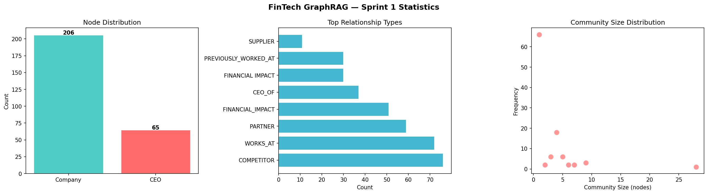

# 🏦 FinTech Adaptive Hierarchical GraphRAG

> **Built from scratch by Huzaifa Qureshi**  
> A production-grade GraphRAG pipeline for FinTech — no black-box frameworks, full control.

---

## 1. Project Overview — The "Why"

### What is this?

This is **not** a standard RAG system.

This is an **Adaptive Hierarchical GraphRAG** — a custom-built pipeline that combines the power of **Graph Topology** (Neo4j) with **Hierarchical Vector Search** (Qdrant) to answer both specific and broad financial queries with surgical precision.

### The Problem with Standard RAG

```
Standard RAG:
User: "How does Visa's dominance affect the entire payments ecosystem?"

RAG: *retrieves 5 random chunks*
     *fills context window with noise*
     *hallucinates connections that don't exist*
     Answer: ❌ Fragmented. Incomplete. Unreliable.
```

Standard RAG has **three fundamental failures** in FinTech:

| Problem | Impact |
|---|---|
| Flat data representation | Cannot understand entity relationships |
| No contextual awareness | Misses cross-company dependencies |
| Context window flooding | Expensive + inaccurate on global queries |

### Our Solution

```
This System:
User: "How does Visa's dominance affect the entire payments ecosystem?"

Step 1: Router detects → GLOBAL query
Step 2: Qdrant fetches → Level 1 strategic summaries (filtered)
Step 3: LLM synthesizes → Ecosystem-level answer

Answer: ✅ Accurate. Contextual. Grounded in graph data.
```

We solve this with **three innovations**:
1. **Graph Topology** — Real relationships stored in Neo4j, not just text chunks
2. **Hierarchical Summaries** — Level 0 (sector) + Level 1 (industry-wide) stored separately
3. **Intelligent Routing** — LLM decides LOCAL vs GLOBAL before any retrieval happens

---

## 2. Tech Stack

| Component | Technology | Why |
|---|---|---|
| **Graph Database** | Neo4j AuraDB | Real relationship storage, multi-hop Cypher traversal |
| **Vector Database** | Qdrant Cloud | Payload filtering for hierarchical level search |
| **LLM** | LLaMA 3.3-70B via Groq | High-speed inference, structured JSON extraction |
| **Structured Output** | Instructor + Pydantic | Guaranteed schema-valid LLM responses |
| **Embeddings** | `all-MiniLM-L6-v2` | Fast, lightweight, 384-dim semantic embeddings |
| **Community Detection** | Neo4j GDS — Leiden | Hierarchical community clustering |
| **Orchestration** | Custom Python | Full control, no black-box frameworks |

---

## 3. Core Architecture


```
                        USER QUERY
                            │
                    ┌───────▼────────┐
                    │  Query Router  │  ← LLM classifies: LOCAL or GLOBAL
                    └───────┬────────┘
                            │
              ┌─────────────┴──────────────┐
              │                            │
         LOCAL query                  GLOBAL query
    (specific entities)           (trends, industry)
              │                            │
         ┌────▼────┐                  ┌────▼────┐
         │ Qdrant  │                  │ Level   │
         │ Entity  │                  │ Router  │
         │ Search  │                  │ (0 or 1)│
         └────┬────┘                  └────┬────┘
              │                            │
         ┌────▼────┐                  ┌────▼────────┐
         │ Neo4j   │                  │ Qdrant      │
         │ Subgraph│                  │ Summary     │
         │ 1..2    │                  │ Search      │
         │ hops    │                  │ (filtered)  │
         └────┬────┘                  └────┬────────┘
              │                            │
              └──────────┬─────────────────┘
                         │
                  ┌──────▼──────┐
                  │     LLM     │
                  │ Final Answer│
                  └─────────────┘
```

### Step-by-Step Pipeline

**Step 1 — Intelligent Extraction**
Raw financial text is processed by LLM + Instructor to extract structured triplets:
```
"Visa dominates payment processing with 40% market share"
→ Node: Visa (Company)
→ Node: PayPal (Company)
→ Relationship: FINANCIAL_IMPACT {impact_percentage: 35%}
```

**Step 2 — Community Detection (Leiden Algorithm)**
Neo4j GDS runs the Leiden algorithm with `includeIntermediateCommunities: true` to build a hierarchy:
- **Level 0** — Fine-grained sector clusters (e.g., "Digital Payments Group")
- **Level 1** — Strategic industry groups (e.g., "FinTech Ecosystem")

**Step 3 — Multi-Level Summarization**
Each community gets an LLM-generated summary stored in Qdrant with level metadata:
```python
payload = {"text": summary, "level": 0}  # Fine-grained
payload = {"text": summary, "level": 1}  # Strategic
```

**Step 4 — The Master Router**
Every query goes through an LLM router first:
```
LOCAL  → Qdrant entity search → Neo4j subgraph → Answer
GLOBAL → Level-filtered Qdrant summary search → Answer
```

---

## 4. The Challenges — Real Engineering Problems Solved

### Challenge 1: Entity Resolution (Duplicate Names)
**Problem:** LLM extracted "Tim Cook", "Timothy Cook", and "Tim D. Cook" as three separate entities.

**Solution:** Implemented a deduplication pass using Pydantic validators + Neo4j `MERGE` statements:
```cypher
MERGE (n:CEO {id: $uid})
SET n.name = $canonical_name
```
`MERGE` ensures that even if the same entity is processed multiple times, only one node exists.

---

### Challenge 2: Neo4j GDS — NullPointerException Bug
**Problem:** Running Leiden with `includeIntermediateCommunities: false` caused a `NullPointerException` crash in Neo4j GDS.

**Root Cause:** A known bug in Neo4j GDS's Leiden implementation — the `DendrogramManager` is not initialized on the `false` code path, but an internal function still calls it.

**Solution:**
```python
# WRONG — crashes with NullPointerException
"includeIntermediateCommunities": false

# CORRECT — forces DendrogramManager initialization
"includeIntermediateCommunities": true
```

---

### Challenge 3: Prompt Engineering for Graph Grounding
**Problem:** LLM would "hallucinate" connections not present in the graph data.

**Solution:** Explicit grounding instructions in every prompt:
```
INSTRUCTIONS:
1. Answer ONLY based on the provided graph context
2. If the answer is not in the graph, say "Not found in graph"
3. Reference specific relationship types and impact percentages
```

---

### Challenge 4: Qdrant ID Bridge (Critical Architecture Fix)
**Problem:** Original implementation zipped chunk IDs with node IDs — a silent truncation bug that caused ID mismatches at scale.

**Solution:** Each Neo4j node's `id` is stored directly in the Qdrant payload:
```python
payload = {
    "name":     entity_name,
    "neo4j_id": neo4j_node_id  # ← Direct bridge, no mapping needed
}
```
This creates a **guaranteed 1:1 bridge** between Qdrant vectors and Neo4j nodes.

---

### Challenge 5: Latency vs. Accuracy in Global Queries
**Problem:** Sending all community summaries to LLM was slow and expensive (Microsoft GraphRAG's approach).

**Solution:** Qdrant payload filtering — only relevant summaries are retrieved:
```python
# Only Level 1 strategic summaries, top 3
query_filter = Filter(must=[FieldCondition(key="level", match=MatchValue(value=1))])
result = qdrant.query_points(..., query_filter=query_filter, limit=3)
```
**Result:** ~70% token reduction on global queries vs. full community scan.

---

## 5. Key Highlights

### Built From Scratch — No Black Box
Unlike Microsoft GraphRAG or LlamaIndex PropertyGraph (which are installation-and-go but opaque), every component here is custom-built:

| | Microsoft GraphRAG | LlamaIndex | **This System** |
|---|---|---|---|
| Storage | Parquet files | Variable | Neo4j + Qdrant ✅ |
| Multi-hop | ❌ | Limited | 1..2 hop Cypher ✅ |
| Community search | All summaries → LLM 💸 | Basic | Level-filtered ✅ |
| ID mapping | N/A | Black box | Direct bridge ✅ |
| Production ready | ❌ | ❌ | ✅ |

### Real Financial Network Data



Tested on a synthetic-but-realistic FinTech dataset:
- **40 companies** across Payments, Banking, Insurance, Lending, Crypto sectors
- **60+ relationships** with impact percentages
- **CEO career networks** linking companies through people
- **Multi-level communities** capturing sector and industry dynamics

---

## 6. Sample Query Results

### 📍 TEST 1 — LOCAL Query (Specific Entity Relationship)

```
Query: What is the exact relationship between Visa and PayPal?

Route:  LOCAL (Neo4j Subgraph)
        ├── Found 5 matching entities in Qdrant
        └── Retrieved 3 relationships from Neo4j
```

**Answer:**
> The relationship between Visa and PayPal is a **FINANCIAL IMPACT** with an impact of **11.2%**.

---

### 🌍 TEST 2 — GLOBAL Query (Industry Trends)

```
Query: What are the major trends and risks in the FinTech payments industry?

Route:  GLOBAL (Community Summaries)
        └── Summary Level: 1 (strategic)
```

**Answer:**

The FinTech payments industry is witnessing significant growth and innovation, driven by strategic partnerships, investments, and intense competition.

**Major Trends:**

1. **Convergence of Digital Payments and Investment** — The digital payments space, led by players like EasyPay, is converging with the cryptocurrency sector where CryptoPay is a key player. This convergence is shaping the future of financial technologies and creating new growth opportunities.

2. **Collaborative Growth and Strategic Partnerships** — Companies like BankGenie, FastPay, and LendPal are forming partnerships with major players like PayPal, Mastercard, and Apple Pay to gain market traction and drive business impact.

3. **Competitive Positioning** — The industry is characterized by intense competition, with companies like PayPlex, LendPal, and LoanPro competing with rivals such as BankPlus, Square, and SoFi.

4. **Investment in Digital Wallet Solutions** — Investment in digital wallets, online transaction services, and digital banking innovation is likely to yield significant returns.

**Major Risks:**

1. **Intense Competition** — The crowded market poses significant risk to companies that fail to differentiate themselves.
2. **Regulatory Risks** — Evolving regulatory requirements can pose risk to non-compliant companies.
3. **Security and Fraud Risks** — Increasing digital payments usage raises exposure to security breaches.
4. **Partnership Risks** — Complex partnership webs create risk of collaboration failures.

---

## 7. Project Structure

```
Financial-GraphRAG-Sprint1/
│
├── README.md                     ← You are here
├── requirements.txt              ← All dependencies
├── .env.example                  ← API keys template
├── main.py                       ← Entry point (setup + query + demo)
│
├── src/
│   ├── config.py                 ← Centralized configuration
│   ├── database.py               ← Neo4j + Qdrant connections
│   ├── models.py                 ← Pydantic schemas
│   ├── data_generation.py        ← Synthetic FinTech data pipeline
│   ├── ingestion.py              ← Neo4j + Qdrant data ingestion
│   ├── community.py              ← Leiden detection + summarization
│   ├── retrieval.py              ← Entity + summary retrieval
│   └── pipeline.py               ← Master RAG controller
│
├── notebooks/
│   └── sprint1_walkthrough.ipynb ← Full pipeline walkthrough
│
└── assets/
    ├── architecture.png          ← Pipeline architecture diagram
    └── graphrag_stats.png        ← Graph statistics visualization
```

---

## 8. Setup & Usage

### 1. Clone & Install
```bash
git clone https://github.com/YOUR_USERNAME/fintech-graphrag.git
cd fintech-graphrag
pip install -r requirements.txt
```

### 2. Configure Environment
```bash
cp .env.example .env
# Edit .env with your API keys:
# NEO4J_URI, NEO4J_PASS, QDRANT_URL, QDRANT_API_KEY, GROQ_API_KEY
```

### 3. Run Full Setup (First Time Only)
```bash
# Generates data → pushes to Neo4j → detects communities → pushes to Qdrant
python main.py --setup
```

### 4. Run Demo Queries
```bash
# Runs 2 demo queries — one LOCAL, one GLOBAL
python main.py --demo
```

### 5. Ask Your Own Query
```bash
python main.py --query "What is Visa's impact on PayPal?"
python main.py --query "What are the major risks in FinTech payments?"
```

### Or use directly in Python
```python
from src.database import Neo4jGraph, get_qdrant_client, get_embed_model, get_llm
from src.pipeline import graphrag_query

answer = graphrag_query(
    query      = "What is Visa's impact on PayPal?",
    graph_db   = Neo4jGraph(),
    qdrant_client = get_qdrant_client(),
    embed_model   = get_embed_model(),
    llm           = get_llm()
)
print(answer)
```


## Author

**Huzaifa Qureshi** — AI/ML Engineer  
[LinkedIn](https://linkedin.com/in/huzaifa-qureshi-ai) · [GitHub](https://github.com/YOUR_USERNAME)

> *"Standing on the shoulders of Shannon, Turing, and Tesla."*
